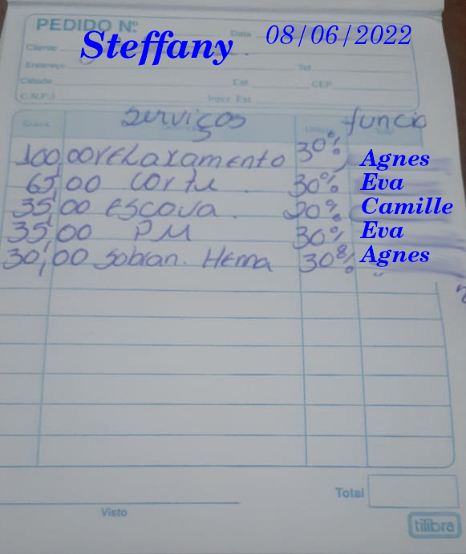
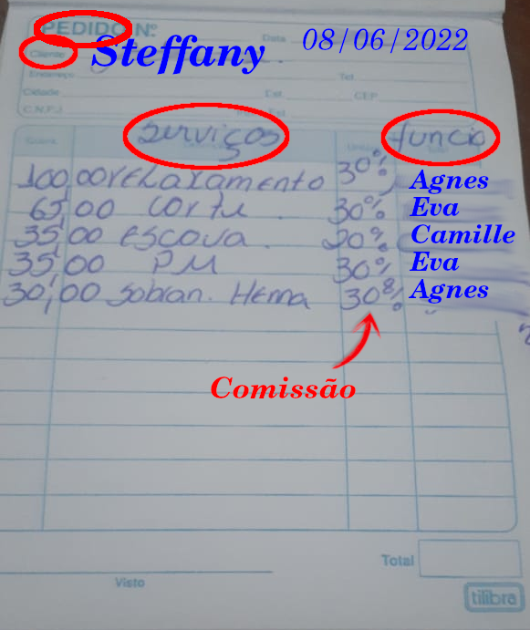
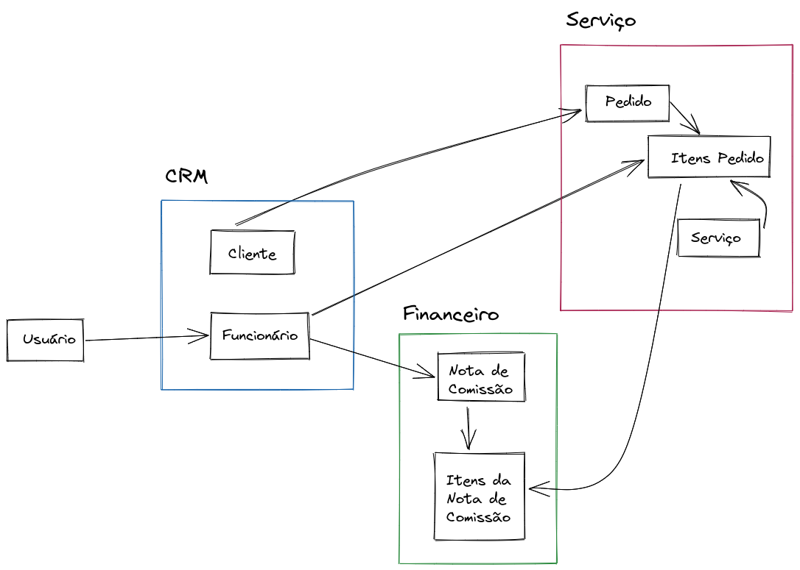
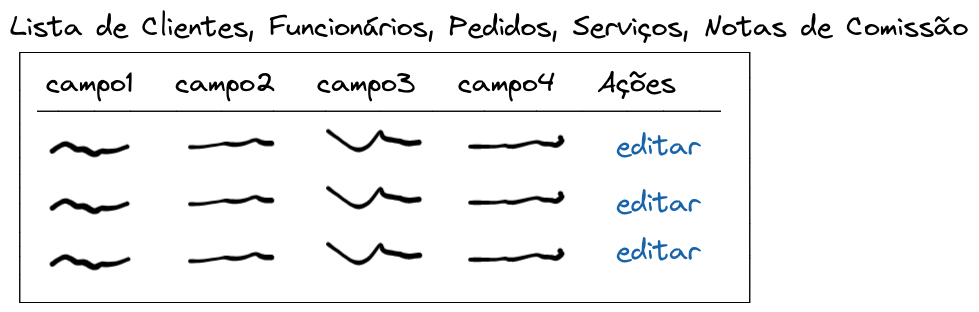
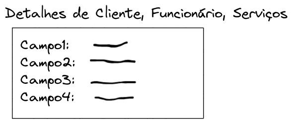
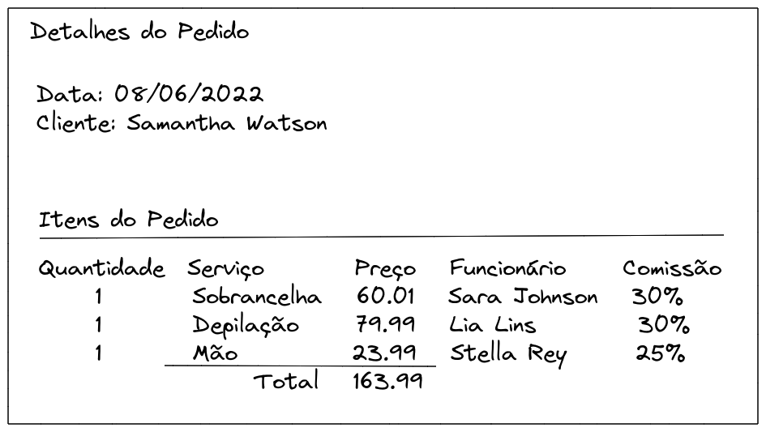
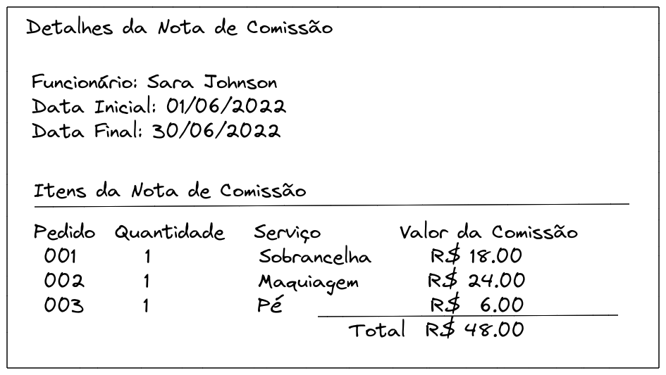
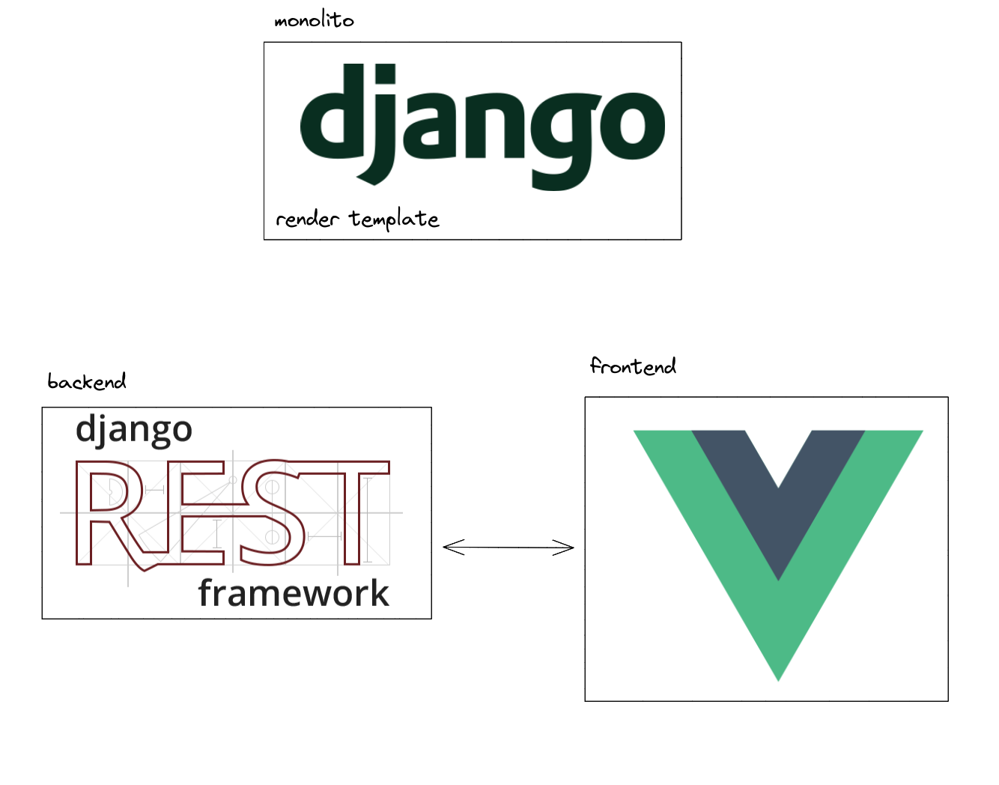
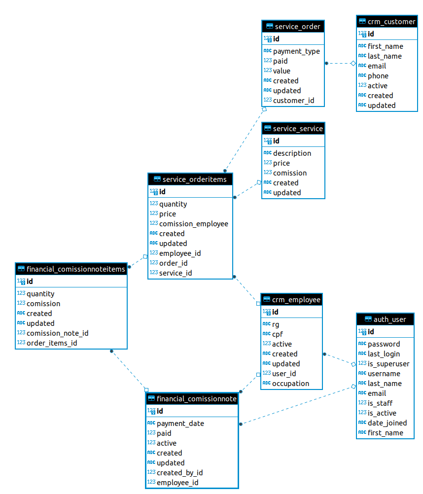

# A Arte de Resolver Problemas

A Arte de Resolver Problemas

é um livro do George Pólya

https://pt.wikipedia.org/wiki/How_to_Solve_It

## Problema

> "Eu preciso gerenciar as comissões dos meus funcionários."


"""
Eu tenho uma ficha de serviços prestados para um cliente.

Nessa ficha tem vários serviços, só que cada um foi feito por um funcionário diferente.

Cada serviço tem seu valor fixo, e o valor de comissão (em porcentagem) por cada serviço.

Eu preciso saber quanto eu devo de comissão para cada funcionário ao final de cada mês.

Só isso.
"""




## Os 4 assuntos fundamentais para se resolver um problema

segundo George Pólya

1. Compreender o problema
2. Elaborar um plano
3. Executar o plano
4. Revise o seu trabalho


### Detalhado

1. Compreender o problema

* Cadastrar os clientes
* Cadastrar os funcionários
* Cadastrar os serviços
    * valor fixo
    * comissão (em porcentagem)
* Cadastrar os pedidos
* Calcular a comissão para cada funcionário


2. Elaborar um plano

* Entender como o cliente fazia antes
* Modelar o banco de dados
* Desenhar as telas
* Cadastrar tudo
* Calcular a comissão de cada funcionário


3. Executar o plano

* Modelar o banco de dados
* Desenhar as telas
* Cadastrar tudo
* Calcular a comissão de cada funcionário
* Banco: PostgreSQL
* Linguagem: Python
* Framework: Django REST framework
* Frontend: VueJS


#### Palavras-chave



* Cliente
* Funcionário
* Serviços
* Pedido
* Itens do Pedido
* Valor
* Comissão














## Apps

* CRM
* Serviço
* Financeiro


## Tabelas

* CRM
    * Cliente
    * Funcionário

* Serviço
    * Pedido
    * Itens do Pedido
    * Serviço

* Financeiro
    * Nota da Comissão
    * Itens da Nota da Comissão


### Campos

* CRM
    * Customer
        * first_name
        * last_name
        * email
        * phone
        * active (bool)

    * Employee
        * user (FK)
        * occupation
        * rg
        * cpf
        * active (bool)

* Service
    * Order (Pedido)
        * customer (FK)
        * payment_type (choice)
        * paid (bool)
        * value
        * created
        * modified

    * OrderItems (Itens do Pedido)
        * order (FK)
        * service (FK)
        * quantity (int)
        * price
        * employee (FK)
        * comission_employee
        * created
        * modified

    * Service
        * description
        * price
        * comission

* Financial
    * ComissionNote (Nota da Comissão)
        * created_by (FK) User
        * employee (FK)
        * payment_date
        * paid (bool)
        * created
        * modified
        * active

    * ComissionNoteItems (Itens da Nota da Comissão)
        * comission_note (FK)
        * order_items (FK) (pega cada serviço de Itens do Pedido)
        * quantity
        * comission (valor da comissão) (calcula e depois salva)
        * created
        * modified



### Criando o ambiente

```
python -m venv .venv
source .venv/bin/activate
# .venv\Scrips\activate

pip install django \
dr_scaffold \
djangorestframework \
django-extensions \
python-decouple

pip freeze > requirements.txt

python contrib/env_gen.py
```

### requirements.txt

```
Django==4.0.*
django-extensions==3.1.*
djangorestframework==3.13.*
dr-scaffold==2.1.*
python-decouple==3.6
```

### Criando o projeto

```
django-admin startproject backend .
```

### Escrevendo o modelo com dr_scaffold

Edite `settings.py`

```python
# settings.py
from decouple import config

SECRET_KEY = config('SECRET_KEY')

INSTALLED_APPS = [
    ...
    # apps de terceiros
    'rest_framework',
    'dr_scaffold',
    'django_extensions',
]

LANGUAGE_CODE = 'pt-br'

TIME_ZONE = 'America/Sao_Paulo'

STATIC_URL = 'static/'
STATIC_ROOT = BASE_DIR.joinpath('staticfiles')

```

### Comandos do dr_scaffold

https://www.dicas-de-django.com.br/45-drf-scaffold

```
python manage.py dr_scaffold \
crm Customer \
first_name:charfield \
last_name:charfield \
email:emailfield \
phone:charfield \
active:booleanfield

python manage.py dr_scaffold \
crm Employee \
user:foreignkey:User \
occupation:charfield \
rg:charfield \
cpf:charfield \
active:booleanfield

python manage.py dr_scaffold \
service Service \
description:charfield \
price:decimalfield \
comission:decimalfield

python manage.py dr_scaffold \
service Order \
customer:foreignkey:Customer \
payment_type:charfield \
paid:booleanfield \
value:decimalfield

python manage.py dr_scaffold \
service OrderItems \
order:foreignkey:Order \
service:foreignkey:Service \
quantity:integerfield \
price:decimalfield \
employee:foreignkey:Employee \
comission_employee:decimalfield

python manage.py dr_scaffold \
financial ComissionNote \
created_by:foreignkey:User \
employee:foreignkey:Employee \
payment_date:datefield \
paid:booleanfield \
active:booleanfield

python manage.py dr_scaffold \
financial ComissionNoteItems \
comission_note:foreignkey:ComissionNote \
order_items:foreignkey:OrderItems \
quantity:integerfield \
comission:decimalfield
```

### Arrumando serializers e views

```
mkdir crm/api
mv crm/serializers.py crm/api
mv crm/views.py crm/api/viewsets.py

mkdir financial/api
mv financial/serializers.py financial/api
mv financial/views.py financial/api/viewsets.py

mkdir service/api
mv service/serializers.py service/api
mv service/views.py service/api/viewsets.py
```

### Melhorando o `models.py`

```python
# crm/models.py
from django.contrib.auth.models import User
from django.db import models


class Customer(models.Model):
    first_name = models.CharField('nome', max_length=255)
    last_name = models.CharField('sobrenome', max_length=255, null=True, blank=True)  # noqa E501
    email = models.EmailField('e-mail', max_length=254, null=True, blank=True)
    phone = models.CharField('telefone', max_length=255, null=True, blank=True)
    active = models.BooleanField('ativo', default=True)
    created = models.DateTimeField('criado em', auto_now_add=True)
    updated = models.DateTimeField('modificado em', auto_now=True)

    class Meta:
        ordering = ('first_name',)
        verbose_name = 'Cliente'
        verbose_name_plural = 'Clientes'

    @property
    def full_name(self):
        return f'{self.first_name} {self.last_name or ""}'.strip()

    def __str__(self):
        return self.full_name


class Employee(models.Model):
    user = models.ForeignKey(
        User,
        verbose_name='usuário',
        on_delete=models.CASCADE,
        null=True
    )
    occupation = models.CharField('cargo', max_length=50, null=True, blank=True)  # noqa E501
    rg = models.CharField('RG', max_length=9, null=True, blank=True)
    cpf = models.CharField('CPF', max_length=11, null=True, blank=True)
    active = models.BooleanField('ativo', default=True)
    created = models.DateTimeField('criado em', auto_now_add=True)
    updated = models.DateTimeField('modificado em', auto_now=True)

    class Meta:
        ordering = ('user__first_name',)
        verbose_name = 'Funcionário'
        verbose_name_plural = 'Funcionários'

    def __str__(self):
        return f'{self.user.get_full_name()}'
```

```python
# financial/models.py
from django.contrib.auth.models import User
from django.db import models

from backend.crm.models import Employee
from backend.service.models import OrderItems


class ComissionNote(models.Model):
    created_by = models.ForeignKey(
        User,
        verbose_name='criado por',
        on_delete=models.CASCADE
    )
    employee = models.ForeignKey(
        Employee,
        verbose_name='funcionário',
        on_delete=models.CASCADE
    )
    payment_date = models.DateField('data de pagamento', null=True, blank=True)
    paid = models.BooleanField('pago?', default=False)
    active = models.BooleanField('ativo', default=True)
    created = models.DateTimeField('criado em', auto_now_add=True)
    updated = models.DateTimeField('modificado em', auto_now=True)

    class Meta:
        ordering = ('-pk',)
        verbose_name = 'Nota de Comissão'
        verbose_name_plural = 'Notas de Comissão'

    def __str__(self):
        return f'{str(self.pk).zfill(3)}'


class ComissionNoteItems(models.Model):
    comission_note = models.ForeignKey(
        ComissionNote,
        verbose_name='nota de comissão',
        on_delete=models.CASCADE,
        null=True
    )
    order_items = models.ForeignKey(
        OrderItems,
        verbose_name='itens do pedido',
        on_delete=models.CASCADE,
        null=True
    )
    quantity = models.IntegerField('quantidade', null=True, default=1)
    comission = models.DecimalField(
        'valor da comissão',
        max_digits=5,
        decimal_places=2,
        default=0.0
    )
    created = models.DateTimeField('criado em', auto_now_add=True)
    updated = models.DateTimeField('modificado em', auto_now=True)

    class Meta:
        ordering = ('comission_note', 'pk')
        verbose_name = 'Item da Nota de Comissão'
        verbose_name_plural = 'Itens da Nota de Comissão'

    def __str__(self):
        return f'{self.comission_note} {str(self.pk).zfill(3)}'
```

```python
# service/models.py
from django.db import models

from backend.crm.models import Customer, Employee


class Service(models.Model):
    description = models.CharField('descrição', max_length=255, unique=True)
    price = models.DecimalField(
        'preço',
        max_digits=5,
        decimal_places=2,
        default=0.0
    )
    comission = models.DecimalField(
        'comissão',
        max_digits=5,
        decimal_places=2,
        default=0.0
    )
    created = models.DateTimeField('criado em', auto_now_add=True)
    updated = models.DateTimeField('modificado em', auto_now=True)

    class Meta:
        ordering = ('description',)
        verbose_name = 'Serviço'
        verbose_name_plural = 'Serviços'

    def __str__(self):
        return f'{self.description}'


PAYMENT_TYPE = (
    ('di', 'Dinheiro'),
    ('de', 'Débito'),
    ('cr', 'Crédito'),
    ('pix', 'Pix'),
    ('dep', 'Depósito'),
)


class Order(models.Model):
    customer = models.ForeignKey(
        Customer,
        verbose_name='cliente',
        on_delete=models.CASCADE,
        null=True
    )
    payment_type = models.CharField(
        'tipo de pagamento',
        max_length=3,
        choices=PAYMENT_TYPE,
        default='di'
    )
    paid = models.BooleanField('pago?', default=False)
    value = models.DecimalField(
        'valor',
        max_digits=5,
        decimal_places=2,
        null=True,
        default=0.0
    )
    created = models.DateTimeField('criado em', auto_now_add=True)
    updated = models.DateTimeField('modificado em', auto_now=True)

    class Meta:
        ordering = ('-pk',)
        verbose_name = 'Pedido'
        verbose_name_plural = 'Pedidos'

    def __str__(self):
        return f'{str(self.pk).zfill(3)}'


class OrderItems(models.Model):
    order = models.ForeignKey(
        Order,
        verbose_name='ordem',
        on_delete=models.CASCADE,
        null=True
    )
    service = models.ForeignKey(
        Service,
        verbose_name='serviço',
        on_delete=models.CASCADE,
        null=True
    )
    quantity = models.IntegerField('quantidade', default=1)
    price = models.DecimalField(
        'preço',
        max_digits=5,
        decimal_places=2,
        null=True,
        default=0.0
    )
    employee = models.ForeignKey(
        Employee,
        verbose_name='funcionário',
        on_delete=models.CASCADE,
        null=True
    )
    comission_employee = models.DecimalField(
        'comissão',
        max_digits=5,
        decimal_places=2,
        null=True,
        default=0.0
    )
    created = models.DateTimeField('criado em', auto_now_add=True)
    updated = models.DateTimeField('modificado em', auto_now=True)

    class Meta:
        ordering = ('order', 'pk')
        verbose_name = 'Item do Pedido'
        verbose_name_plural = 'Itens do Pedido'

    def __str__(self):
        return f'{self.order} {str(self.pk).zfill(3)}'
```

### Movendo as pastas para dentro de backend

```
mv crm/ backend/
mv financial/ backend/
mv service/ backend/
```

### Configurando o `settings.py`

```python
# settings.py
INSTALLED_APPS = [
    ...
    # minhas apps
    'backend.crm',
    'backend.financial',
    'backend.service',
]
```

### Editando `apps.py`

```python
# crm/apps.py
...
name = 'backend.crm'
```

```python
# financial/apps.py
...
name = 'backend.financial'
```

```python
# service/apps.py
...
name = 'backend.service'
```

### Arrumando `admin.py`


```python
# crm/admin.py
from django.contrib import admin

from .models import Customer, Employee


@admin.register(Customer)
class CustomerAdmin(admin.ModelAdmin):
    exclude = ()


@admin.register(Employee)
class EmployeeAdmin(admin.ModelAdmin):
    exclude = ()
```


```python
# financial/admin.py
from django.contrib import admin

from .models import ComissionNote, ComissionNoteItems


class ComissionNoteItemsInline(admin.TabularInline):
    model = ComissionNoteItems
    extra = 0


@admin.register(ComissionNote)
class ComissionNoteAdmin(admin.ModelAdmin):
    inlines = (ComissionNoteItemsInline,)
    list_display = (
        '__str__',
        'created_by',
        'employee',
        'payment_date',
        'paid',
        'active'
    )
    readonly_fields = ('created_by',)
    search_fields = ('created_by__first_name', 'employee__first_name')
    list_filter = ('paid', 'active')
    date_hierarchy = 'created'
    ordering = ('-created',)

    def save_model(self, request, obj, form, change):
        if not change:
            obj.created_by = request.user
            obj.save()
        super(ComissionNoteAdmin, self).save_model(request, obj, form, change)


@admin.register(ComissionNoteItems)
class ComissionNoteItemsAdmin(admin.ModelAdmin):
    exclude = ()
```


```python
# service/admin.py
from django.contrib import admin

from .models import Order, OrderItems, Service


@admin.register(Service)
class ServiceAdmin(admin.ModelAdmin):
    list_display = ('__str__', 'price', 'comission')
    search_fields = ('description',)


class OrderItemsInline(admin.TabularInline):
    model = OrderItems
    extra = 0


@admin.register(Order)
class OrderAdmin(admin.ModelAdmin):
    inlines = (OrderItemsInline,)
    list_display = ('__str__', 'customer', 'payment_type', 'paid', 'value')
    search_fields = ('name',)
    list_filter = ('paid', 'payment_type',)
    date_hierarchy = 'created'
    ordering = ('-created',)


@admin.register(OrderItems)
class OrderItemsAdmin(admin.ModelAdmin):
    exclude = ()
```


### Editando Serializers

```python
# crm/api/serializers.py
from django.contrib.auth.models import User
from rest_framework import serializers

from backend.crm.models import Customer, Employee


class UserSerializer(serializers.ModelSerializer):

    class Meta:
        model = User
        fields = (
            'id',
            'username',
            'first_name',
            'last_name',
            'email',
        )
        ref_name = 'Custom User Serializer'


class CustomerSerializer(serializers.ModelSerializer):

    class Meta:
        model = Customer
        fields = '__all__'


class EmployeeSerializer(serializers.ModelSerializer):

    class Meta:
        model = Employee
        fields = '__all__'
        depth = 1


class EmployeeCreateSerializer(serializers.ModelSerializer):
    user = UserSerializer()

    class Meta:
        model = Employee
        fields = ('user', 'occupation', 'rg', 'cpf', 'active')

    def create(self, validated_data):
        # Cria user
        if 'user' in validated_data:
            user = validated_data.pop('user')

            user = User.objects.create(**user)
            employee = Employee.objects.create(user=user, **validated_data)

        return employee


class EmployeeUpdateSerializer(serializers.ModelSerializer):
    user = UserSerializer()

    class Meta:
        model = Employee
        fields = ('user', 'occupation', 'rg', 'cpf', 'active')

    def update(self, instance, validated_data):
        # Edita user
        if 'user' in validated_data:
            user = validated_data.pop('user')

            for attr, value in user.items():
                setattr(instance.user, attr, value)

            instance.user.save()

        # Edita demais campos
        for attr, value in validated_data.items():
            setattr(instance, attr, value)

        instance.save()

        return instance
```

```python
# financial/api/serializers.py
from rest_framework import serializers

from backend.crm.api.serializers import EmployeeSerializer
from backend.financial.models import ComissionNote, ComissionNoteItems
from backend.service.api.serializers import OrderItemsSerializer


class ComissionNoteItemsSerializer(serializers.ModelSerializer):
    order_items = OrderItemsSerializer()

    class Meta:
        model = ComissionNoteItems
        fields = '__all__'


class ComissionNoteSerializer(serializers.ModelSerializer):
    employee = EmployeeSerializer()
    comission_note_items = ComissionNoteItemsSerializer(
        source='comissionnoteitems_set',
        many=True,
        read_only=True
    )

    class Meta:
        model = ComissionNote
        fields = '__all__'
```

```python
# service/api/serializers.py
from rest_framework import serializers

from backend.crm.api.serializers import EmployeeSerializer
from backend.service.models import Order, OrderItems, Service


class ServiceSerializer(serializers.ModelSerializer):

    class Meta:
        model = Service
        fields = ('id', 'description', 'price', 'comission')


class OrderItemsSerializer(serializers.ModelSerializer):
    employee = EmployeeSerializer()
    service = ServiceSerializer()

    class Meta:
        model = OrderItems
        fields = '__all__'
        depth = 1


class OrderItemsCreateSerializer(serializers.ModelSerializer):

    class Meta:
        model = OrderItems
        fields = '__all__'


class OrderSerializer(serializers.ModelSerializer):
    order_items = OrderItemsSerializer(
        source='orderitems_set',
        many=True,
        read_only=True
    )

    class Meta:
        model = Order
        fields = (
            'id',
            'customer',
            'payment_type',
            'paid',
            'value',
            'created',
            'updated',
            'order_items',
        )
        depth = 1


class OrderCreateSerializer(serializers.ModelSerializer):
    order_items = OrderItemsCreateSerializer(
        source='orderitems_set',
        many=True
    )

    class Meta:
        model = Order
        fields = (
            'customer',
            'payment_type',
            'paid',
            'value',
            'order_items',
        )


class OrderUpdateSerializer(serializers.ModelSerializer):

    class Meta:
        model = Order
        fields = '__all__'
```

### Editando Viewsets

```python
# crm/api/viewsets.py
from rest_framework import viewsets

from backend.crm.api.serializers import (
    CustomerSerializer,
    EmployeeCreateSerializer,
    EmployeeSerializer,
    EmployeeUpdateSerializer
)
from backend.crm.models import Customer, Employee


class CustomerViewSet(viewsets.ModelViewSet):
    queryset = Customer.objects.all()
    serializer_class = CustomerSerializer


class EmployeeViewSet(viewsets.ModelViewSet):
    queryset = Employee.objects.all()

    def get_serializer_class(self):
        if self.action == 'create':
            return EmployeeCreateSerializer

        if self.action == 'update' or self.action == 'partial_update':
            return EmployeeUpdateSerializer

        return EmployeeSerializer
```


```python
# financial/api/viewsets.py
from rest_framework import viewsets

from backend.financial.api.serializers import (
    ComissionNoteItemsSerializer,
    ComissionNoteSerializer
)
from backend.financial.models import ComissionNote, ComissionNoteItems


class ComissionNoteViewSet(viewsets.ModelViewSet):
    queryset = ComissionNote.objects.all()
    serializer_class = ComissionNoteSerializer


class ComissionNoteItemsViewSet(viewsets.ModelViewSet):
    queryset = ComissionNoteItems.objects.all()
    serializer_class = ComissionNoteItemsSerializer
```


```python
# service/api/viewsets.py
from django.contrib.auth.models import User
from rest_framework import viewsets
from rest_framework.decorators import action
from rest_framework.response import Response

from backend.financial.models import ComissionNote, ComissionNoteItems
from backend.service.api.serializers import (
    OrderCreateSerializer,
    OrderItemsSerializer,
    OrderSerializer,
    OrderUpdateSerializer,
    ServiceSerializer
)
from backend.service.models import Order, OrderItems, Service


class ServiceViewSet(viewsets.ModelViewSet):
    queryset = Service.objects.all()
    serializer_class = ServiceSerializer


class OrderViewSet(viewsets.ModelViewSet):
    queryset = Order.objects.all()

    def get_serializer_class(self):
        if self.action == 'create':
            return OrderCreateSerializer

        if self.action == 'update' or self.action == 'partial_update':
            return OrderUpdateSerializer

        return OrderSerializer

    def perform_create(self, serializer):
        # Pega os Itens do Pedido.
        order_items = serializer.validated_data.pop('orderitems_set')
        # Salva o Pedido
        order = serializer.save()

        # Salva os Itens do Pedido.
        for item in order_items:
            OrderItems.objects.create(**item, order=order)

    @action(detail=True, methods=['post'])
    def generate_comission_note(self, request, pk=None):
        '''
        Gera Notas de Comissão para cada Funcionário a partir do Pedido selecionado.
        '''
        order = self.get_object()
        order_items = order.orderitems_set.all()
        comission_note_items = ComissionNoteItems.objects.values_list(
            'order_items', flat=True)

        for item in order_items:
            if item.pk not in comission_note_items:
                cn = ComissionNote.objects.filter(
                    employee=item.employee, paid=False).first()
                if cn:
                    ComissionNoteItems.objects.create(
                        comission_note=cn,
                        order_items=item,
                        quantity=item.quantity,
                        comission=item.price * item.comission_employee
                    )
                else:
                    # Cria as Notas de Comissão.
                    comission_note = ComissionNote.objects.create(
                        employee=item.employee,
                        created_by=User.objects.first()
                    )

                    ComissionNoteItems.objects.create(
                        comission_note=comission_note,
                        order_items=item,
                        quantity=item.quantity,
                        comission=item.price * item.comission_employee
                    )

        return Response({})


class OrderItemsViewSet(viewsets.ModelViewSet):
    queryset = OrderItems.objects.all()
    serializer_class = OrderItemsSerializer
```

### Configurando `urls.py`


```python
# urls.py
from django.contrib import admin
from django.urls import include, path


urlpatterns = [
    path('', include('backend.crm.urls', namespace='crm')),
    path('', include('backend.financial.urls', namespace='financial')),
    path('', include('backend.service.urls', namespace='service')),
    path('admin/', admin.site.urls),
]

```

```python
# crm/urls.py
from django.urls import include, path
from rest_framework import routers

from backend.crm.api.viewsets import CustomerViewSet, EmployeeViewSet

app_name = 'crm'

router = routers.DefaultRouter()

router.register(r'customers', CustomerViewSet)
router.register(r'employees', EmployeeViewSet)

urlpatterns = [
    path('api/v1/', include(router.urls)),
]

```

```python
# financial/urls.py
from django.urls import include, path
from rest_framework import routers

from backend.financial.api.viewsets import (
    ComissionNoteItemsViewSet,
    ComissionNoteViewSet
)

app_name = 'financial'

router = routers.DefaultRouter()

router.register(r'comissionnotes', ComissionNoteViewSet)
router.register(r'comissionnoteitem', ComissionNoteItemsViewSet)

urlpatterns = [
    path('api/v1/', include(router.urls)),
]

```

```python
# service/urls.py
from django.urls import include, path
from rest_framework import routers

from backend.service.api.viewsets import (
    OrderItemsViewSet,
    OrderViewSet,
    ServiceViewSet
)

app_name = 'service'

router = routers.DefaultRouter()

router.register(r'services', ServiceViewSet)
router.register(r'orders', OrderViewSet)
router.register(r'orderitem', OrderItemsViewSet)

urlpatterns = [
    path('api/v1/', include(router.urls)),
]

```

### Criando as migrações

```
python manage.py makemigrations
python manage.py migrate
python manage.py createsuperuser
```

### Documentação com Swagger

```
pip install -U drf-yasg

pip freeze | grep drf-yasg >> requirements.txt
```

Edite `settings.py`

```python
INSTALLED_APPS = [
   ...
   'django.contrib.staticfiles',  # required for serving swagger ui's css/js files
   'drf_yasg',
   ...
]
```

Edite `urls.py`

```python
from django.contrib import admin
from django.urls import include, path
from drf_yasg import openapi
from drf_yasg.views import get_schema_view
from rest_framework import permissions

schema_view = get_schema_view(
    openapi.Info(
        title="Snippets API",
        default_version='v1',
        description="Test description",
        terms_of_service="https://www.google.com/policies/terms/",
        contact=openapi.Contact(email="contact@snippets.local"),
        license=openapi.License(name="BSD License"),
    ),
    public=True,
    permission_classes=(permissions.AllowAny,),
)


urlpatterns = [
    path('', include('backend.crm.urls', namespace='crm')),
    path('', include('backend.financial.urls', namespace='financial')),
    path('', include('backend.service.urls', namespace='service')),
    path('admin/', admin.site.urls),
]

# swagger
urlpatterns += [
   path('doc/', schema_view.with_ui('swagger', cache_timeout=0), name='schema-swagger-ui'),  # noqa E501
   path('redoc/', schema_view.with_ui('redoc', cache_timeout=0), name='schema-redoc'),  # noqa E501
]

```


### Rodando o backend

```
python manage.py runserver
```


## Resolvendo o problema de CORS headers

```
python -m pip install django-cors-headers
pip freeze | grep django-cors-headers >> requirements.txt
```

```python
# settings.py
CORS_ALLOWED_ORIGINS = [
    'http://localhost:8080',
]

# Application definition

INSTALLED_APPS = [
    ...
    'corsheaders',
    ...
]

MIDDLEWARE = [
    ...
    # corsheaders
    'corsheaders.middleware.CorsMiddleware',
    'django.middleware.common.CommonMiddleware',
    ...
]

```

### Gerando Dados

Abra o terminal e digite

```
python manage.py shell_plus
```

```python
services = [
    {
        "description": "Barba",
        "price": 35,
        "comission": 0.3
    },
    {
        "description": "Corte",
        "price": 65,
        "comission": 0.3
    },
    {
        "description": "Depilação",
        "price": 130,
        "comission": 0.35
    },
    {
        "description": "Escova",
        "price": 35,
        "comission": 0.2
    },
    {
        "description": "Pé e Mão",
        "price": 35,
        "comission": 0.32
    },
    {
        "description": "Relaxamento",
        "price": 100,
        "comission": 0.3
    },
    {
        "description": "Sobrancelha",
        "price": 30,
        "comission": 0.3
    }
]

for service in services:
    Service.objects.create(**service)
```


## Frontend

https://www.creative-tim.com/product/vuetify-material-dashboard

```
cd frontend
npm install
npm run serve
```


## Quarto fundamento


4. Revise o seu trabalho

* O sistema é escalável?
* O que pode ser feito para melhorar?
* A hospedagem está num lugar bom? Heroku, AWS, Google Cloud...


## Livros

1. Aprenda Django 3 com Exemplos: Crie aplicações web profissionais em Python, começando do zero

Antonio Melé

Editora Novatec

https://www.amazon.com.br/Aprenda-Django-com-Exemplos-profissionais-ebook/dp/B08FF7S39V


2. Two Scoops of Django 3.x

Daniel & Audrey Greenfeld

https://www.feldroy.com/books/two-scoops-of-django-3-x


## Documentação

https://www.djangoproject.com/

https://www.django-rest-framework.org/

https://vuejs.org/

https://vuetifyjs.com/en/


## Meu canal

https://www.youtube.com/c/RegisdoPython/

## Redes

Github, Twitter, Instagram

@rg3915

